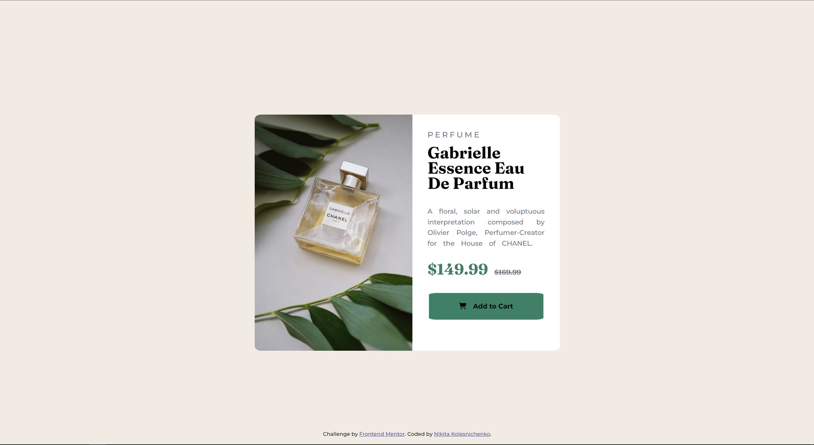

# Frontend Mentor - Product preview card component solution

This is a solution to the [Product preview card component challenge on Frontend Mentor](https://www.frontendmentor.io/challenges/product-preview-card-component-GO7UmttRfa). Frontend Mentor challenges help you improve your coding skills by building realistic projects. 

## Table of contents

- [Overview](#overview)
  - [The challenge](#the-challenge)
  - [Screenshot](#screenshot)
- [My process](#my-process)
  - [Built with](#built-with)
  - [What I learned](#what-i-learned)
  - [Continued development](#continued-development)
  - [Useful resources](#useful-resources)
- [Author](#author)
- [Acknowledgments](#acknowledgments)

**Note: Delete this note and update the table of contents based on what sections you keep.**

## Overview

### The challenge

Users should be able to:

- View the optimal layout depending on their device's screen size
- See hover and focus states for interactive elements

### Screenshot

## My process

### Built with

- HTML5
- CSS custom properties
- CSS Grid

### What I learned

I practiced my skills to recreate the design showed on pictures attached to challenge. It was quite nice to put my recently learned skills into practice.

### Continued development

I would like to continue working with mobile development first. Additionally, I am going to learn JavaScript and React to enhance my toolset for creating responsive and good-looking web applications.

### Useful resources

- [1](https://developer.mozilla.org/en-US/docs/Web/CSS/CSS_Transitions/Using_CSS_transitions) - This is useful for setting up transitions
- [2](https://www.tutorialspoint.com/css/css_positioning.htm) - Was useful for positioning text on the page

## Author

- Frontend Mentor - [Bollo](https://www.frontendmentor.io/profile/Bollo)
- LinkedIn - [Nikita Kolesnichenko](https://www.linkedin.com/in/nikita-kolesnichenko/)

